# Social Explorer

Social explorer is an app that lets the user explore social network's places with an iPhone. Each place has a collection of fotos and information that the explorer can see and mark as favorite to visit that please sometime ;)

Currently, the information comes from Instagram and Foursquare.

### Starting

First, the user starts the app and enables the social networks to use. 

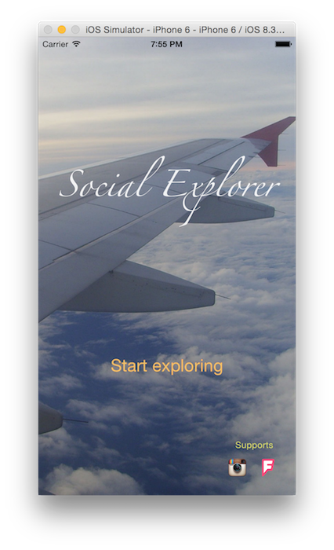

Once at least one network is selected, the user can "continue" and start exploring.

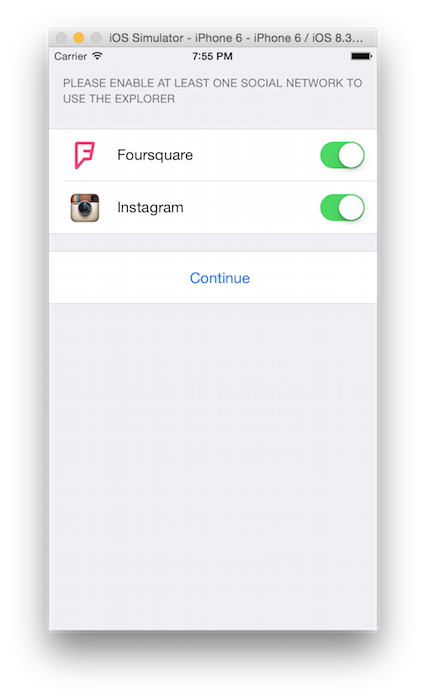

### Structure

The app has three tabs.

* a) Discovery: View used to explore locations using a map
* b) Favorites: Collection of favorite medias
* c) Settings: Social networks that will be used during the exploring.

### a) Discovery tab

The main screen of the app is the "Discovery tab". This tab is used to navigate and place "references". 

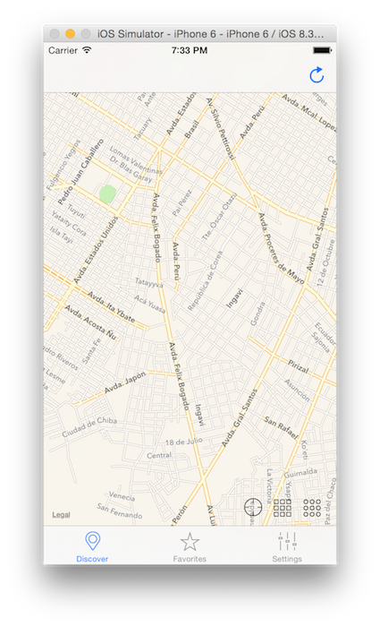

A reference is a current point in map used to search locations arround it. The user places a reference with a "long tap" on the map. 
A pin represents a "reference" it will automatically fetch all the places in a ~1000 meters radius. Each place, or location from now on, has photos (medias) that you can view.

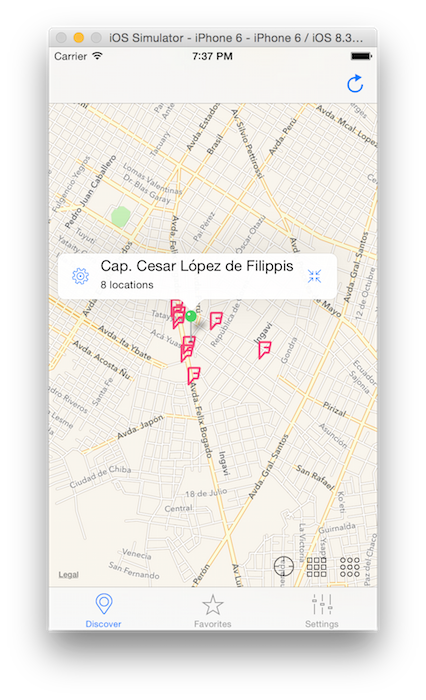

*Implementation note: a Reference has a many-to-many relationship with the locations. Each location has a one-to-many relationship with the media. This way a location won't be duplicated, but the media is owned by the location.*

You can move the references to continue exploring. Every time you move the reference (the pin), more locations around it are added to the reference, which gets more locations each time.

When the reference is added or moved it changes to "red", and once it start having locations it turns into purple. When you see it as green the reference is ready.

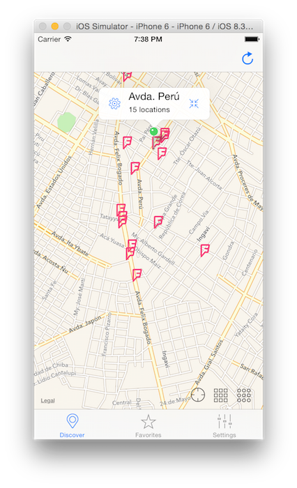

You can create as many references as you want. 

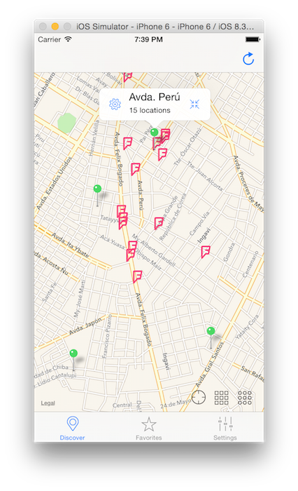

#### a.1) Reference info and actions

To view the reference's locations you can tap on the reference pin and a "bubble" will appear. This bubble (callout) gives the user some information about the explored locations. Click on the right icon of the buttle to view the locations and their media.

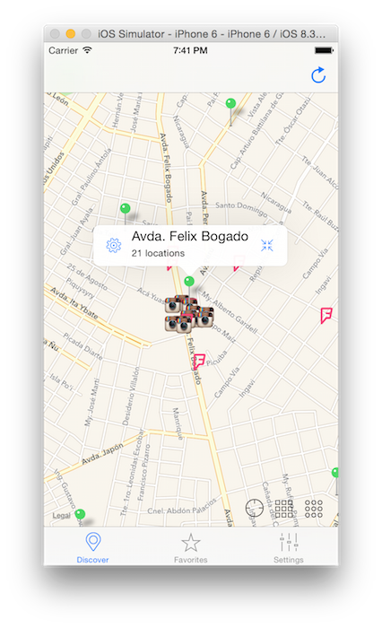

If the user clicks on the left button she can delete the reference.

In the map you have other controls on the bottom right that permits zooming on references or locations.

The "locate me" button will use the phone GPS to get the current location and move the view to that location.

The "little squares matrix" button lets view all the references you already have.

The "little circles matrix" button lets the user view all the locations of the selected reference. 

#### a.2) Reference locations

After clicking the callout the list of places and ther medias will appear in the map and in a list.

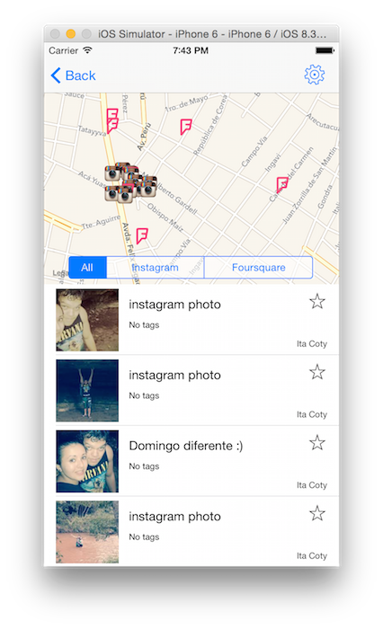

Here you can do a lot of things:
On the map you can tap the location and view the name. Also, the list will scroll to the corresponding medias.
Also, as you scroll the location will be selected in the map.

You can mark the media as favorite by tapping on the "start" button. Repeat the action to revert the mark.

If you want to filter by social media you can select a specific segment . E.g. Instagram.
 
To view the media you have to tap the row of the list.

And finally, you can delete the reference by tapping on the "gear" icon on the navigation menu.

### Media info

In this view you have a larger media. Here you can view a summary of the information about the media. Also, the location of the media in the map.

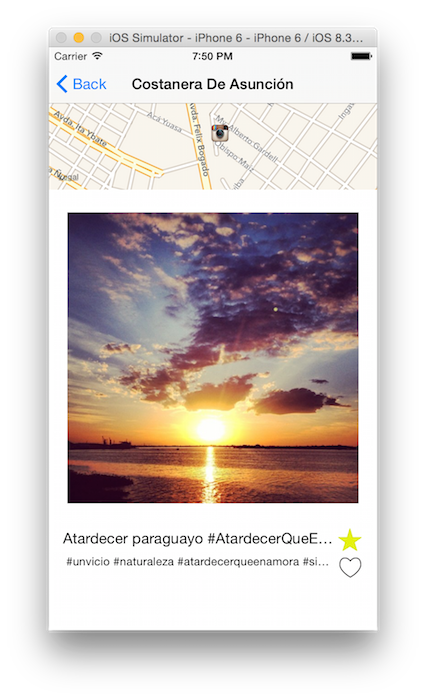

If the media came from Instagram a heart will appear and wil show if you liked it on Instagram or not.

Can also amrk or unmark as favorite.

### Favorites

This tap show a collection of favorite photos.  

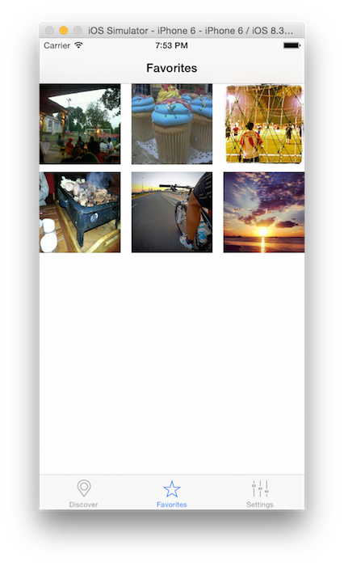

If you tap on a photo it will show the media info.

### Settings

This tap lets the user enable or disable social networks to use.

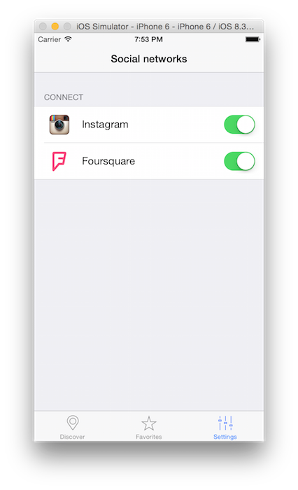

## Important

This is a iOS 8 project submition for Udacity's 'Intro to iOS App Development with Swift'
It uses Swift 1.2, cocoapods 0.37.1 and iOS 8.3

## Development environment setup

1) Install cocoapods

`sudo gem install cocoapods`

2) Clone the project and go inside it
3) Install the pods

`pod install`

4) Open the project

`open SocialExplorer.xcworkspace`

## Some ideas for the future versions

* Include Twitter and facebook
* Search places by name
* Remove locations 
* View photos as a slideshow